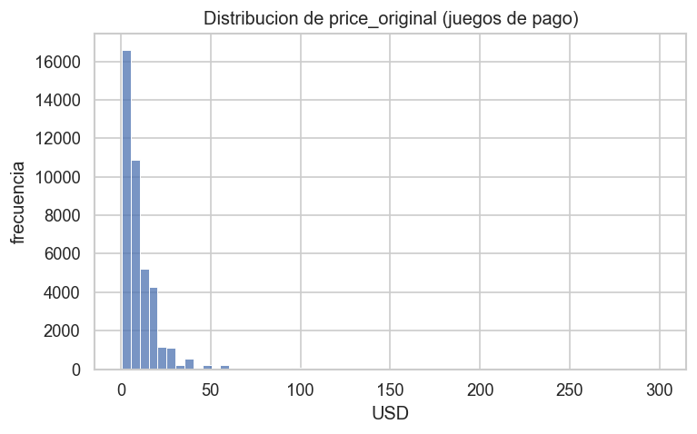
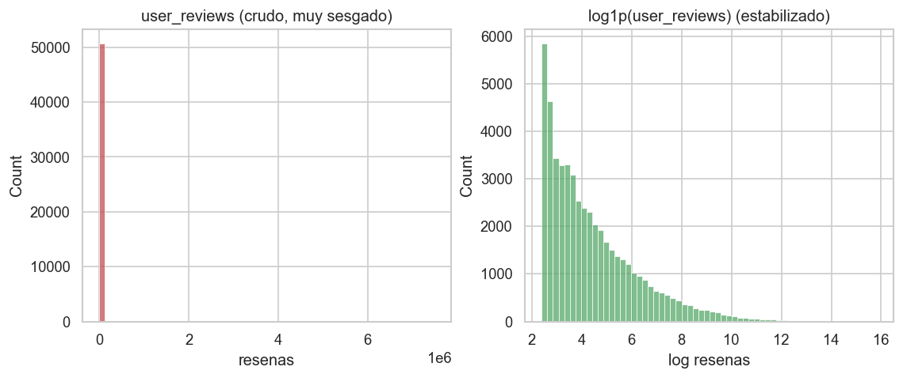
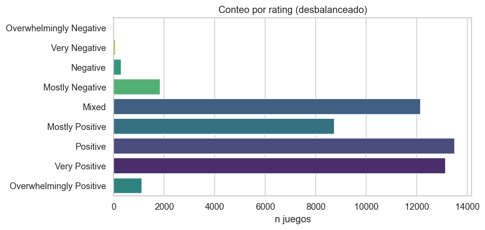
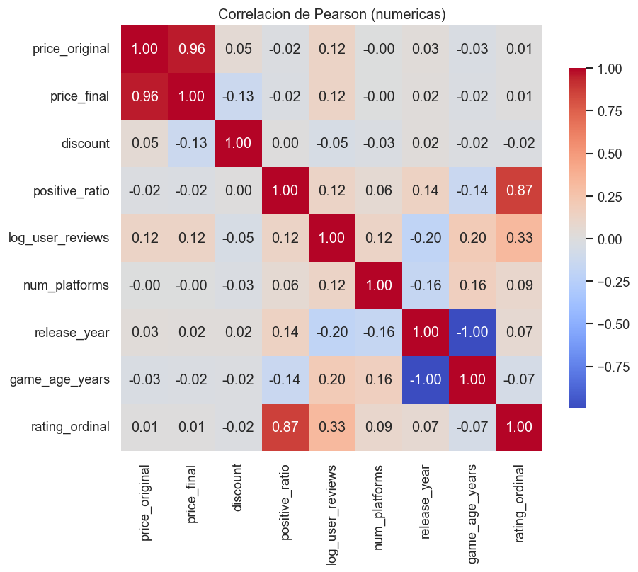
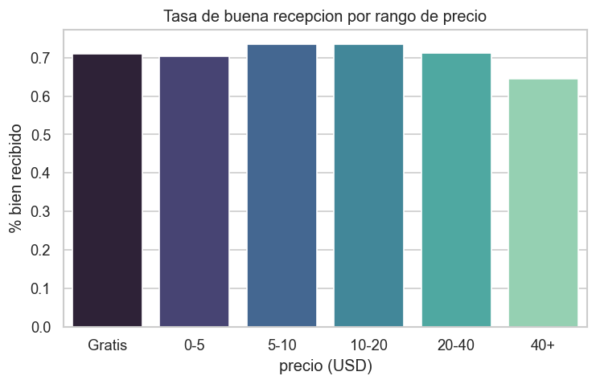
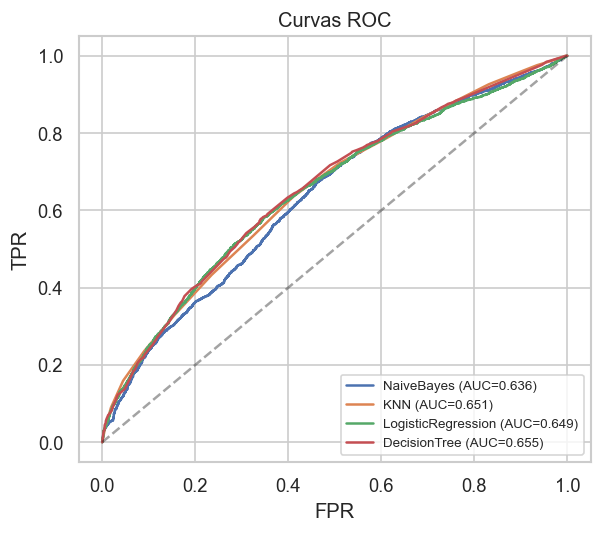
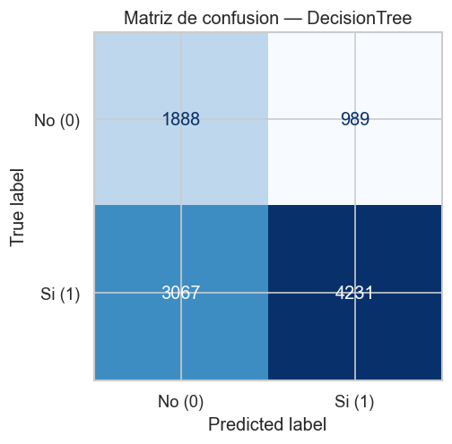

# Proyecto Data Mining — Corte 1
## Pipeline Full Stack sobre el catálogo de Steam

**Curso:** Minería de Datos · UPCh 2026A — **Modalidad:** Individual

`233312 · Franco Gutiérrez  · Moises`

---

## 1. Planteamiento

Se construye un pipeline completo —de dato crudo a producto— sobre el catálogo de
**Steam** (50.872 juegos, 1997–2023). El dataset es real e imperfecto, y permite a
la vez una pregunta de **regresión** y una de **clasificación**:

| Tarea | Pregunta de negocio | Target |
|---|---|---|
| Regresión | ¿Qué **precio base** soporta un juego de pago? | `price_original` (USD) |
| Clasificación | ¿Será **bien recibido** por la comunidad? | `well_received` (binario) |

**Por qué este dataset.** Tiene una mezcla de variables numéricas (precios,
reseñas, % positivo), categóricas (rating ordinal), temporales (fecha de
lanzamiento) y booleanas (plataformas), con imperfecciones que obligan a trabajar
los datos: una columna casi constante (`steam_deck`, 99.996 % `True`), 985 filas
con `price_final > price_original` (imposible por definición), y `user_reviews`
extremadamente sesgada (mediana 49, máximo 7.49 M). No es un dataset de juguete
ya resuelto.

## 2. Capa de datos

### 2.1 Limpieza (determinista)

Decisiones (en `ml/src/data_cleaning.py`), todas justificadas:

- **Se descarta `steam_deck`**: sin varianza útil (casi constante).
- **Se corrige el precio**: en las 985 filas inconsistentes se fija
  `price_final = price_original` y se **recalcula** `discount` de forma coherente.
- **Fechas** a `datetime`; se derivan `release_year/quarter/month/decade` y
  `game_age_years` respecto a un corte fijo (2024-01-01) para que sea reproducible.
- **`log_user_reviews = log1p(user_reviews)`**: la variable cruda tiene skew 137.8;
  el log lo baja a 1.29 (ver Fig. 2).
- **Semántica del rating**: se mapea a rango ordinal 1–9 y a cubeta de sentimiento
  (Negativo/Mixto/Positivo). El target binario **`well_received = (rango ≥ 6)`**
  (familia *Positive*); *Mixed* cae deliberadamente en la clase 0.

### 2.2 Warehouse dimensional (esquema estrella, DuckDB)

`ml/src/warehouse.py` construye un **esquema estrella**. Se elige estrella (no copo
de nieve) porque las dimensiones son pequeñas y planas, sin jerarquías que
justifiquen normalizar más; esto favorece consultas OLAP rápidas.

- **Grano del hecho `fact_game` = un juego.** Medidas: `positive_ratio`,
  `user_reviews`, `price_original/final`, `discount`, `well_received`, `game_age_years`.
- **`dim_date`** (tiempo de lanzamiento), **`dim_rating`** (sentimiento ordinal),
  **`dim_platform`** (combinación de plataformas). Claves surrogate **deterministas**
  (`date_key=yyyymmdd`, `rating_key=1..9`, `platform_key=win*4+mac*2+linux`).
- Vista `v_games` (hecho + 3 dimensiones) para OLAP cómodo desde la API.

Operaciones OLAP reales soportadas y expuestas en la app: **roll-up** (por
año/década), **slice** (por sentimiento), **dice** (por plataforma) y **drill-down**
(top juegos).

## 3. EDA (sustenta el modelado)

El EDA (`ml/eda/eda.py`) es reproducible y genera figuras + un resumen JSON. Cada
figura motiva una decisión:

*Fig. 1 — `price_original` sesgado a la derecha (skew 5.16): cola de títulos AAA caros.*

*Fig. 2 — `user_reviews` cruda vs `log1p`: el log estabiliza la escala → se usa en los modelos.*

*Fig. 3 — Rating muy desbalanceado (de 14 a 13.502 ejemplos) → no usar accuracy sola.*

*Fig. 4 — Correlaciones. `release_year` vs `game_age_years` = **−0.996** (colinealidad: se
usa solo una); `positive_ratio` vs `rating_ordinal` = **0.866** (el rating deriva del
% positivo → fuga si se usa en clasificación).*

*Fig. 5 — La tasa de buena recepción varía por rango de precio: hay señal (débil) para clasificar.*

## 4. Modelado

### 4.1 Preprocesamiento y prevención de fuga

Un único `ColumnTransformer` parametrizado por tarea (`preprocessing.py`):
numéricas → `StandardScaler`; `platform_combo` → `OneHotEncoder`. Va **dentro** de
un `Pipeline` de sklearn, de modo que el escalado y el one-hot se ajustan **solo con
el split de entrenamiento** (y se validan con K-fold sobre *train*). **Sin fuga.**

Selección de features anti-fuga y sin redundancia:

- **Regresión** (`price_original`): se entrena **solo con juegos de pago**; se
  excluyen `price_final` y `discount` (derivan del precio base). Features:
  `game_age_years`, `positive_ratio`, `log_user_reviews`, `platform_combo`.
- **Clasificación** (`well_received`): se **excluyen `positive_ratio`, `rating` y
  `rating_ordinal`** porque Steam construye la etiqueta a partir de ellos (sería
  fuga trivial). Features: `game_age_years`, `price_original`, `log_user_reviews`,
  `platform_combo`, `is_free`.

### 4.2 Regresión — precio base

Partición 80/20 (semilla 42), `n_train=32.625`, `n_test=8.157`. Métricas en USD.

| Modelo | CV-RMSE | R² (test) | MAE (test) | RMSE (test) |
|---|---|---|---|---|
| Baseline (mediana) | — | −0.061 | 7.16 | 12.40 |
| LinearRegression | 11.371 | 0.087 | 6.93 | 11.50 |
| RandomForest | 11.235 | 0.111 | 6.90 | 11.35 |
| **HistGradientBoosting** ✓ | **11.109** | **0.135** | **6.79** | **11.20** |
| HistGB (target log) | 11.583 | 0.049 | 6.49 | 11.74 |

**Decisión sobre el target log.** Aunque el precio está muy sesgado, transformar el
target con `log1p` **empeora** el R² en escala original (0.05 vs 0.14): el log
subpondera los títulos caros. Se modela por tanto el precio directo en USD; la
variante log queda registrada como evidencia. Se elige **HistGradientBoosting** por
menor RMSE de validación cruzada. Importancias: `game_age_years` y `log_user_reviews`
dominan, seguidas de `positive_ratio`; la plataforma aporta poco.

### 4.3 Clasificación — recepción

Partición 80/20 **estratificada**, `n_train=40.697`, `n_test=10.175`. Clase positiva
= 71.7 %. Se comparan los **cuatro algoritmos del curso**; selección por **F1-macro**
de CV estratificada. Los parámetros usan `class_weight='balanced'`.

| Modelo | CV-F1m | F1-macro | ROC-AUC | PR-AUC | bal-acc | accuracy |
|---|---|---|---|---|---|---|
| NaiveBayes | 0.445 | 0.420 | 0.636 | 0.809 | 0.501 | 0.717 |
| KNN | 0.530 | 0.535 | 0.651 | 0.814 | 0.547 | 0.712 |
| LogisticRegression | 0.575 | 0.578 | 0.649 | 0.821 | 0.616 | 0.602 |
| **DecisionTree** ✓ | **0.578** | **0.579** | **0.655** | 0.820 | 0.618 | 0.601 |

*Fig. 6 — Curvas ROC de los cuatro clasificadores.*

*Fig. 7 — Matriz de confusión del árbol elegido.*

**Por qué accuracy sola engaña.** Naive Bayes alcanza 0.717 de accuracy —idéntico a
predecir siempre "positivo"— pero su balanced-accuracy es 0.501 (azar) y su F1-macro
0.420: no aprende la clase minoritaria. Por eso la métrica de selección es F1-macro.

**Lectura del modelo elegido (árbol), clase a clase:**

| Clase | Precision | Recall | F1 | Soporte |
|---|---|---|---|---|
| No recibido (0) | 0.381 | **0.656** | 0.482 | 2.877 |
| Bien recibido (1) | 0.811 | 0.580 | 0.676 | 7.298 |

Con `class_weight='balanced'`, el modelo **recupera el 65.6 % de los juegos mal
recibidos** (recall de la clase minoritaria) a costa de precisión: es el clásico
trade-off bajo desbalance, y es la operación deseable si el objetivo es **detectar a
tiempo** lanzamientos en riesgo. Árbol y regresión logística empatan
(F1m 0.578–0.579) y baten claramente a Naive Bayes (independencia de features,
violada) y KNN.

## 5. Producto: API + frontend

- **API REST (FastAPI, `api/`)** expone dos familias sobre el **backend real**:
  `/olap/*` (consultas dimensionales sobre el warehouse, incluido un **cubo
  genérico** dimensión×medida×agregación con listas blancas anti-inyección) y
  `/predict/*` (inferencia en vivo de ambos modelos). Swagger en `/docs`.
- **Frontend (Streamlit, `frontend/`)** consume **solo** la API: KPIs, explorador
  OLAP interactivo (Plotly) y formularios de predicción en vivo. Sin datos ni
  imágenes precocinadas.

## 6. Limitaciones y honestidad

- **Precio poco predecible (R² ≈ 0.14).** El dataset carece de los verdaderos
  drivers del precio (género, alcance, estudio/editor, modelo de monetización). El
  modelo capta tendencias suaves (antigüedad, popularidad) pero no fija precios con
  precisión. *Qué haría distinto:* enriquecer con género/tags y datos del editor.
- **Recepción moderadamente predecible (ROC-AUC ≈ 0.65).** Al excluir —correctamente—
  el % de reseñas (que define la etiqueta), la señal restante (precio, plataformas,
  antigüedad, popularidad) es real pero limitada. El recall de la clase 0 es útil,
  pero la precisión es baja: habría falsos positivos.
- **Sesgo de supervivencia.** Solo hay juegos publicados y con ≥10 reseñas; no
  representa el universo completo de Steam.
- **`game_age` en inferencia** se aproxima por año (no fecha exacta); diferencia
  menor frente al entrenamiento.

## 7. Reproducibilidad

Todo se reconstruye desde el README: `python -m ml.src.run_pipeline` regenera
limpieza, warehouse, EDA y ambos modelos de forma determinista (semilla 42); luego
se levantan API y frontend. Sin pasos ocultos.

## 8. Conclusión

El pipeline integra las cuatro capas (warehouse dimensional → EDA →
modelado → API → app) sobre un dataset real. El valor no está en métricas altas
—que se reportan con honestidad— sino en la **metodología defendible**: diseño
dimensional explícito, prevención rigurosa de fuga, métricas elegidas según el
problema y un producto funcional que opera sobre el backend real.
